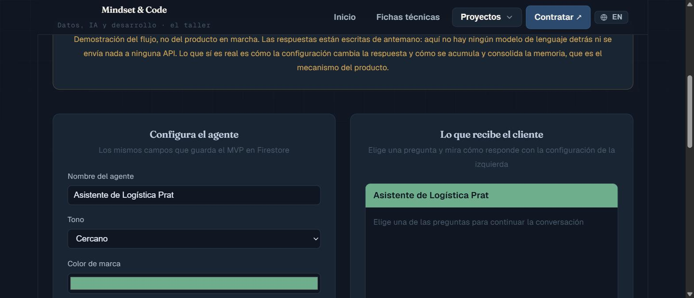
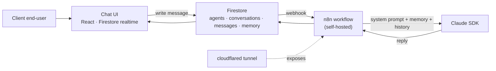
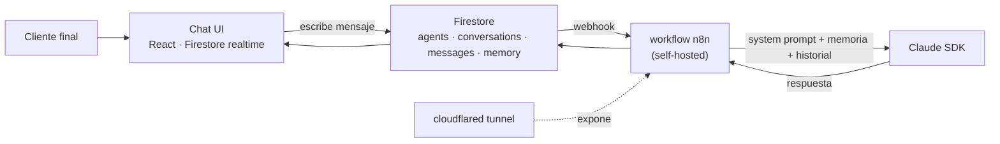

# AgentForge — AI Agent Deployment Platform

> **SaaS · AI automation** · React · Firebase · n8n · Claude
> **Status:** ✅ MVP codebase in repo — pending Firebase project setup + n8n credentials to go live
> A platform that lets agencies deploy custom AI agents for their clients in under an hour: configure a system prompt, tools and memory, and hand the client a personalized chat URL. The agent learns from use and consolidates memory nightly.

> 🇬🇧 **English version first.** · 🇪🇸 **La versión en español está más abajo** → [ir a Español](#-español).

*[Open the live demo](https://proyectos-mindset-code.web.app/agentforge)*

---

## The problem this solves

Companies increasingly want an "AI employee", but they don't know how to build or operate one. Agencies and consultancies *have* the know-how — yet they lack a **product** to deliver it repeatably and profitably. AgentForge is that missing layer: ready-made infrastructure where an agency configures an agent once (system prompt, tools, memory, brand) and ships it to a client as a personalized chat URL — no custom build each time.

The differentiator is a **cognitive memory architecture**: the agent doesn't just answer, it *remembers* — accumulating long-term facts about the client and consolidating them over time.

---

## Architecture

| Layer | Technology |
|-------|-----------|
| Frontend | React · Vite · TailwindCSS → Firebase Hosting (Spark, free tier) |
| Database | Firestore — agents, conversations, messages, memory, config |
| Orchestration | n8n (self-hosted) — processes messages, calls Claude, updates memory |
| AI | Claude SDK — per-agent configurable system prompt |
| Public exposure | cloudflared tunnel → n8n reachable publicly |

**Agent engine flow:** `POST /webhook/message` → read agent config → read last 10 messages → read long-term memory facts → build the full prompt (`system prompt + memory + history`) → call Claude → persist the reply to Firestore → the realtime listener renders it in the chat.

---

## Cognitive memory

A two-tier model that mimics human cognition:

- **Short-term:** the last *N* messages of the current conversation injected into context (N configurable per agent, default 10).
- **Long-term:** when a session closes (or every *X* messages), n8n asks Claude to extract up to 5 key facts from the transcript and persists them in Firestore (`memory/{agentId}/facts/`), to be re-injected in future conversations.
- **Knowledge base:** per-client markdown documents.

---

## Roadmap

Tracked as 5 epics (see project board):

| Epic | Scope | Status |
|------|-------|--------|
| **1 · Infrastructure** | Firebase project, Firestore schema, Vite+React+TS scaffold, `firestore.rules`, cloudflared→n8n | ✅ In repo |
| **2 · Chat UI** | `AgentChat` / `Chat` / `MessageBubble` / `TypingIndicator` / `MessageInput`, Firestore realtime, route `/chat/{agentId}` | ✅ In repo |
| **3 · Agent Engine** | n8n workflow + Claude integration (the flow above) | ✅ In repo (`n8n/agent-engine.json`) |
| **4 · Cognitive Memory** | short-term + long-term fact extraction | ✅ In repo (`n8n/memory-consolidation.json` + memory UI) |
| **5 · Admin Dashboard** | create/manage agents, view conversations, edit memory, copy public URL | ✅ In repo |

**MVP Demo milestone:** one functional agent with realtime chat, session memory, deployed on Firebase, demo-able for clients.

---

## Tech stack

| Layer | Technology |
|-------|-----------|
| Frontend | React · Vite · TailwindCSS |
| Backend / data | Firebase (Hosting + Firestore) |
| Orchestration | n8n (self-hosted) |
| AI | Claude (Anthropic SDK) |
| Networking | cloudflared tunnel |

---

## Business model

AgentForge is sold through the Mindset & Code catalogue, where the scope and price of each
engagement are set out in writing: **[AgentForge](https://mindset-code.com/en/codigo/agentforge)**.

What matters technically is that it runs entirely on free or self-hosted tiers — Firebase
Spark, our own n8n — so the operating cost per deployed agent stays close to zero. That is
what makes one agent per client viable in the first place.

---

## Project status

> ℹ️ **Honest status:** the full MVP codebase now lives in this repository — Vite+React+TS chat UI, admin dashboard (Firebase Auth), `firestore.rules`, and both n8n workflows (agent engine + nightly memory consolidation, validated with n8n-mcp). Not yet deployed: requires creating the Firebase project, loading `.env.local`, and importing the n8n workflows with credentials (see `n8n/README.md`).

---

## License & contact

Released under the **[MIT License](LICENSE)**.

- **Web:** [mindset-code.com](https://mindset-code.com)
- **Email:** contacto@mindset-code.com

---

# 🇪🇸 Español

# AgentForge — Plataforma de despliegue de agentes IA

> **SaaS · automatización con IA** · React · Firebase · n8n · Claude
> **Estado:** ✅ Código del MVP en el repo — falta configurar el proyecto Firebase + credenciales n8n para salir a producción
> Una plataforma que permite a agencias desplegar agentes IA personalizados para sus clientes en menos de una hora: configura un system prompt, herramientas y memoria, y entrega al cliente una URL de chat personalizada. El agente aprende con el uso y consolida memoria por la noche.

> 🇪🇸 Traducción al español. La versión en inglés está al inicio → [ir a English](#agentforge--ai-agent-deployment-platform).

---

## El problema que resuelve

Las empresas quieren cada vez más un "empleado IA", pero no saben cómo construirlo ni operarlo. Las agencias y consultoras *tienen* el conocimiento — pero les falta un **producto** para entregarlo de forma repetible y rentable. AgentForge es esa capa que falta: infraestructura lista donde una agencia configura un agente una vez (system prompt, herramientas, memoria, marca) y lo entrega al cliente como una URL de chat personalizada — sin desarrollo a medida cada vez.

El diferenciador es una **arquitectura de memoria cognitiva**: el agente no solo responde, *recuerda* — acumulando hechos a largo plazo sobre el cliente y consolidándolos con el tiempo.

---

## Arquitectura

| Capa | Tecnología |
|------|-----------|
| Frontend | React · Vite · TailwindCSS → Firebase Hosting (Spark, gratis) |
| Base de datos | Firestore — agentes, conversaciones, mensajes, memoria, config |
| Orquestación | n8n (self-hosted) — procesa mensajes, llama a Claude, actualiza memoria |
| IA | Claude SDK — system prompt configurable por agente |
| Exposición pública | cloudflared tunnel → n8n accesible públicamente |

**Flujo del agent engine:** `POST /webhook/message` → leer config del agente → leer últimos 10 mensajes → leer facts de memoria a largo plazo → construir el prompt completo (`system prompt + memoria + historial`) → llamar a Claude → persistir la respuesta en Firestore → el listener en tiempo real la renderiza en el chat.

---

## Memoria cognitiva

Un modelo de dos niveles que imita la cognición humana:

- **Corto plazo:** los últimos *N* mensajes de la conversación actual inyectados en el contexto (N configurable por agente, default 10).
- **Largo plazo:** al cerrar una sesión (o cada *X* mensajes), n8n pide a Claude extraer hasta 5 hechos clave del transcript y los persiste en Firestore (`memory/{agentId}/facts/`), para reinyectarlos en conversaciones futuras.
- **Base de conocimiento:** documentos markdown por cliente.

---

## Roadmap

Organizado en 5 épicas (ver tablero del proyecto):

| Épica | Alcance | Estado |
|-------|---------|--------|
| **1 · Infraestructura** | Proyecto Firebase, schema Firestore, scaffold Vite+React+TS, `firestore.rules`, cloudflared→n8n | ✅ En el repo |
| **2 · Chat UI** | `AgentChat` / `Chat` / `MessageBubble` / `TypingIndicator` / `MessageInput`, Firestore realtime, ruta `/chat/{agentId}` | ✅ En el repo |
| **3 · Agent Engine** | workflow n8n + integración Claude (el flujo de arriba) | ✅ En el repo (`n8n/agent-engine.json`) |
| **4 · Memoria cognitiva** | corto plazo + extracción de facts a largo plazo | ✅ En el repo (`n8n/memory-consolidation.json` + UI de memoria) |
| **5 · Admin Dashboard** | crear/gestionar agentes, ver conversaciones, editar memoria, copiar URL pública | ✅ En el repo |

**Milestone MVP Demo:** un agente funcional con chat en tiempo real, memoria de sesión, desplegado en Firebase, demo-able para clientes.

---

## Stack técnico

| Capa | Tecnología |
|------|-----------|
| Frontend | React · Vite · TailwindCSS |
| Backend / datos | Firebase (Hosting + Firestore) |
| Orquestación | n8n (self-hosted) |
| IA | Claude (Anthropic SDK) |
| Red | cloudflared tunnel |

---

## Modelo de negocio

AgentForge se contrata desde el catálogo de Mindset & Code, donde el alcance y el precio de
cada encargo van por escrito: **[AgentForge](https://mindset-code.com/codigo/agentforge)**.

Lo relevante técnicamente es que corre íntegramente sobre capas gratuitas o autoalojadas
—Firebase Spark, n8n propio—, así que el coste de operación por agente desplegado se queda
cerca de cero. Eso es justamente lo que hace viable un agente por cliente.

---

## Estado del proyecto

> ℹ️ **Estado honesto:** el código completo del MVP ya vive en este repositorio — chat UI Vite+React+TS, admin dashboard (Firebase Auth), `firestore.rules` y los dos workflows n8n (agent engine + consolidación nocturna de memoria, validados con n8n-mcp). Aún sin desplegar: falta crear el proyecto Firebase, rellenar `.env.local` e importar los workflows n8n con credenciales (ver `n8n/README.md`).

---

## Licencia y contacto

Publicado bajo la **[Licencia MIT](LICENSE)**.

- **Web:** [mindset-code.com](https://mindset-code.com)
- **Email:** contacto@mindset-code.com

---

**Ficha del proyecto:** [AgentForge en mindset-code.com](https://mindset-code.com/codigo/agentforge) — qué problema resuelve, para quién y con qué está construido.

*Mindset & Code · asesoría fiscal y tecnológica · [mindset-code.com](https://mindset-code.com)*
